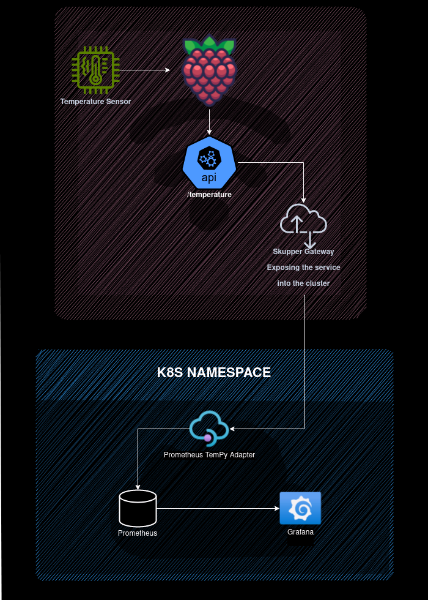
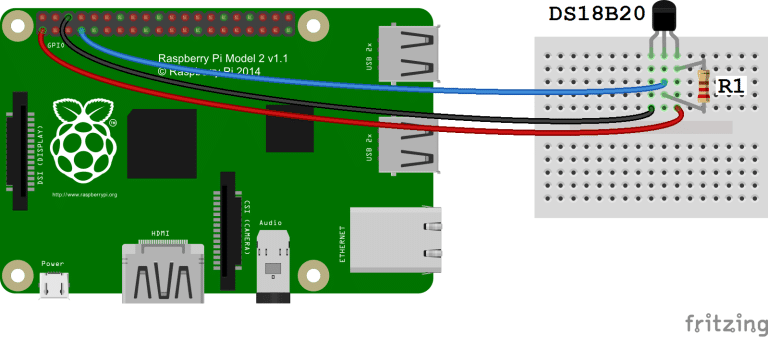
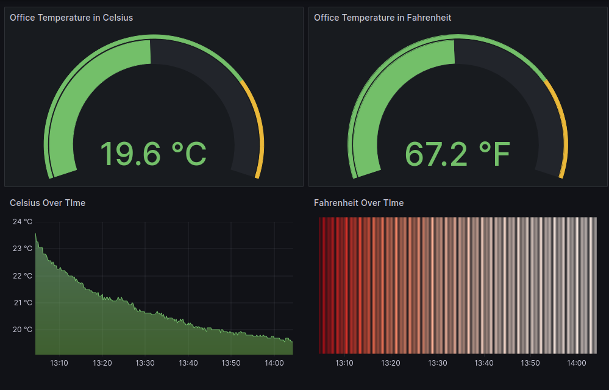

# TemPy

## Description

This project is a proof of concept for an IoT architecture using a Raspberry Pi and a temperature sensor that exposes the temperature data through a REST API. Along with the REST API, there is a cloud integration with any cloud provider using [Skupper](https://skupper.io/) that enables the data to be visualized in a Grafana dashboard.

## Table of Contents

- [Hardware](#hardware)
- [Raspberry Configuration](#raspberry-configuration)
- [Temperature Capture](#temperature-capture)
- [Skupper Role](#skupper-role)
- [Storage on the Cloud](#storage-on-the-cloud)
- [Grafana](#grafana)
- [Contributing](#contributing)
- [License](#license)

## Architecture



The architecture of the project can be divided into the following parts:

### Hardware

This part involves the physical components used in the project, such as the Raspberry Pi and the temperature sensor.

- Raspberry Pi 3 Model B+ [Raspberry Pi 3 Model B+](https://www.raspberrypi.org/products/raspberry-pi-3-model-b-plus/)
- DS18B20 Temperature Sensor [DS18B20 Temperature Sensor](https://www.adafruit.com/product/381)
- 4.7kΩ Resistor [4.7kΩ Resistor](https://www.adafruit.com/product/2784)
- Breadboard [Breadboard](https://www.adafruit.com/product/64)
- Jumper Wires [Jumper Wires](https://www.adafruit.com/product/1956)


### Raspberry Configuration

This part focuses on the setup and configuration of the Raspberry Pi, including installing the necessary software and libraries.

- Ubuntu 23.04 server for Raspberry Pi [Ubuntu Installation](https://ubuntu.com/download/raspberry-pi)
- GoLang 1.18+ [GoLang Installation](https://golang.org/doc/install)
- Skupper 1.5.3 [Skupper Installation](https://skupper.io/start/install.html)
- Podman > 4.3 [Podman Installation](https://podman.io/getting-started/installation)

### Temperature Capture


- Credits: [Raspberry Pi DS18B20 Temperature Sensor Tutorial](https://www.circuitbasics.com/raspberry-pi-ds18b20-temperature-sensor-tutorial/)

In this part, the temperature sensor is connected to the Raspberry Pi, and the code for capturing temperature readings is implemented.

#### Configuration:

* Raspberry Pi GPIO Pins:
   * Pin 1 (3.3V) is connected to the VDD pin of the DS18B20.
   * Pin 7 (GPIO 4) is connected to the DQ pin of the DS18B20.
   * Pin 9 (GND) is connected to the GND pin of the DS18B20.
* DS18B20:
   * The VDD pin is powered by 3.3V from the Raspberry Pi.
   * The DQ pin is connected to GPIO 4 with a pull-up resistor.
   * The GND pin is grounded to the Raspberry Pi.

#### Connections:

* A 4.7kΩ pull-up resistor (R1) is placed between the VDD and DQ lines.
* The VDD line from the DS18B20 is connected to a red wire representing 3.3V from the Raspberry Pi.
* The DQ line is connected to a white wire representing data and is connected to GPIO 4 on the Raspberry Pi.
* The GND line is connected to a black wire representing ground from the Raspberry Pi.

#### Functionality:

* The DS18B20 temperature sensor reports temperature data through the 1-Wire interface, which requires only one data line (and ground) for communication with the Raspberry Pi.
* The pull-up resistor is necessary for the 1-Wire protocol used by the DS18B20 to function correctly.

#### REST API:

* To expose the temperature data, a REST API is implemented using GoLang. The API is used to capture the temperature data and expose it to the cloud provider.

```
go build tempy/tempy.go
```

* The REST API is exposed on port 5000/temperature, and the temperature data can be accessed using the following command:

```bash
curl localhost:5000/temperature
```

### Skupper Role

* Skupper is used to establish communication between the Raspberry Pi and the cloud provider. This part covers the setup and configuration of Skupper.

Skupper site:

1. A namespace running skupper, for this example we will borrow the prometheus service to store the temperature data, so we will init skupper on the cluster with the following command:
```bash
skupper init --site-name site1 --enable-console --enable-flow-collector
```

Skuper gateway on the Raspberry Pi:

* To expose the temperature data to the cloud, we will use a skupper gateway to expose the temperature data to the cloud, for this we will use the following command:

```bash
 skupper gateway expose tempy localhost 5000 --type podman
```

### Storage on the Cloud

The temperature data captured by the Raspberry Pi is stored in the cloud using the chosen cloud provider. This part explains how the data is stored and managed.

For this example, we will use the prometheus service created by skupper to store the temperature data, this is not advisable for production, but it is a good example of how to use skupper to store data in the cloud. To acheive this, we will deploy a prometheus-adapter called TempyPrometheusAdapter that will scrape the temperature data from the Raspberry Pi and will expose the data to the prometheus service. 


#### Prometheus Adapter:
1. Build the TemPy prometheus-adapter image:
```bash
podman build -t quay.io/YOUR-USER/tempy-prometheus-adapter:0.1 -f prometheus-adapter/Dockerfile-TempyPrometheusAdapter .
```
2. Push the image to the quay.io registry:
```bash
podman push quay.io/YOUR-USER/tempy-prometheus-adapter:0.1
```
3. Deploy the prometheus-adapter:
```bash
kubectl apply -f prometheus-adapter/TempyPrometheusAdapter-deployment.yaml
```
4. Expose the prometheus-adapter:
```bash
kubectl apply -f prometheus-adapter/TempyPrometheusAdapter-service.yaml
```
5. Verify the prometheus-adapter is running:
```bash
kubectl run -i --tty --rm curl-pod --image=curlimages/curl -- sh
curl tempy-prometheus-adapter:9090/metrics
...
# TYPE temperature_celsius gauge
temperature_celsius 19.81
# HELP temperature_fahrenheit Current temperature in Fahrenheit
# TYPE temperature_fahrenheit gauge
temperature_fahrenheit 67.66
...
```
6. We are almost there, now we need to patch the skupper prometheus service to scrape the temperature data from the prometheus-adapter, for this we will use the following command:
```bash
kubectl patch cm prometheus-server-config --namespace=skupper-pi --type=merge -p '
data:
  prometheus.yml: |
    global:
      scrape_interval:     15s
      evaluation_interval: 15s
    alerting:
      alertmanagers:
        - static_configs:
            - targets:
    rule_files:
    scrape_configs:
      - job_name: "prometheus"
        metrics_path: "/api/v1alpha1/metrics"
        scheme: "https"
        tls_config:
          insecure_skip_verify: true
        static_configs:
          - targets: ["skupper.skupper-pi.svc.cluster.local:8010"]
      - job_name: "tempy-prometheus-adapter"
        metrics_path: "/metrics"
        scheme: "http"
        static_configs:
          - targets: ["tempy-prometheus-adapter-service.skupper-pi.svc.cluster.local:9090"]
'
```

If all the steps were followed correctly, the temperature data should be stored in the prometheus service, if not please check the logs of the prometheus-adapter and the prometheus service to check for any errors.

### Grafana

The stored temperature data is visualized in a Grafana dashboard. This part covers the setup and configuration of the dashboard.

* To visualize the temperature data, we will use a Grafana dashboard. The dashboard is configured to scrape the temperature data from the prometheus service and visualize it in a graph. The grafana deployment is done using the following command:

1. Create grafana PVC:
```bash
kubectl apply -f grafana/grafana-pvc.yaml
```
2. Create grafana deployment:
```bash
kubectl apply -f grafana/grafana-deployment.yaml
```
3. Create grafana service:
```bash
kubectl apply -f grafana/grafana-service.yaml
```
Important: My cluster is configrued to use the ingress controller, so I have to create an ingress to expose the grafana service, if your cluster is not configured to use the ingress controller, you will neeed either to expose the grafana service using a nodeport or a loadbalancer.

4. Create a data source connection in grafana that points to the prometheus service:
```bash
http://skupper-prometheus:9090
```

5. Import the grafana dashboard:
```bash
grafana/dashboard.json
```

6. FINALY, you should be able to visualize the temperature data in the grafana dashboard.




## Contributing

Fell free to contribute to the project, you can open an issue or a pull request and I will be happy to review it.

## License

Apache License 2.0 [LICENSE](https://www.apache.org/licenses/LICENSE-2.0)